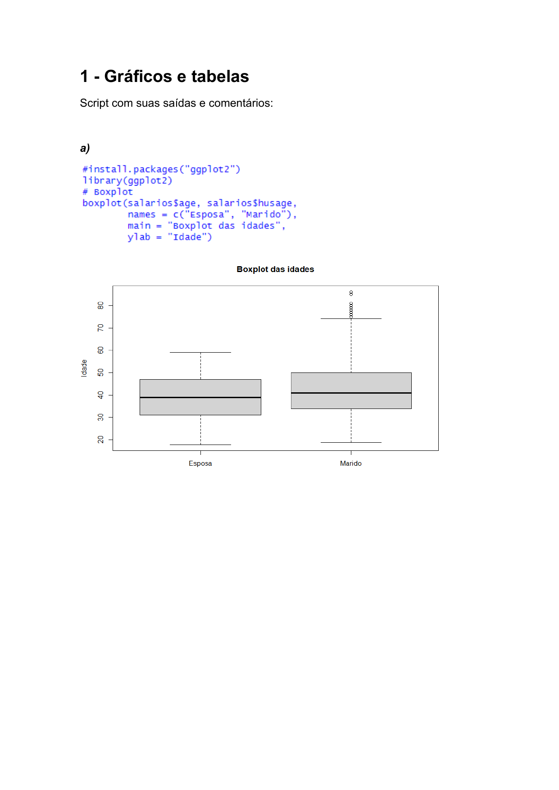
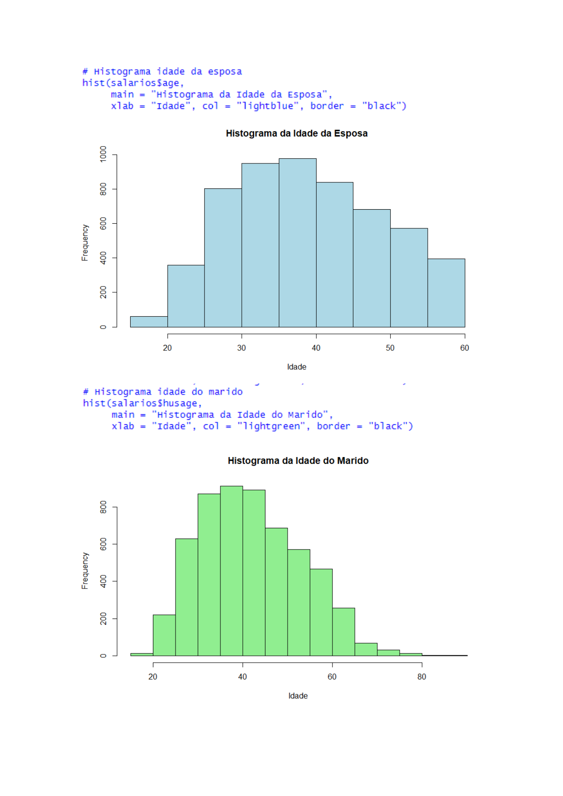

# 📊 Applied Statistical Inference & Regularized Econometric Modeling in R


---

## 📌 Project Overview

This repository consolidates two applied statistical and econometric studies in **R**:

1. **Applied Statistics I: Parametric & Non-Parametric Demographic Analysis:** Exploratory analysis, central tendency/dispersion metrics, Shapiro-Wilk normality testing, and Mann-Whitney U non-parametric hypothesis testing comparing age distributions (`salarios.RData`).
2. **Applied Statistics II: Regularized Econometric Wage Regression & Bootstrap Inference:** Building regularized linear regression models (**Ridge**, **Lasso**, **ElasticNet**) on log hourly wage data (`trabalhosalarios.RData`), with 95% non-parametric bootstrap confidence intervals.

---

## 📈 Visual Exploratory Data Analysis (EDA) & Charts

Below are the rendered visual statistical distributions comparing wife age (`age`) and husband age (`husage`):

### 1. Comparative Boxplots (Central Tendency & Dispersion)

*Figure 1: Comparative boxplots displaying distribution spread, quartiles, and median age offset.*

### 2. Frequency Histograms

*Figure 2: Distribution histograms highlighting age density and positive skewness.*

---

## 🔬 Part 1: Inferential Statistics & Non-Parametric Testing

### 📊 Summary Statistics Matrix

| Variable | Mean | Median | Mode | Variance | Std Dev | CV (%) |
| :--- | :---: | :---: | :---: | :---: | :---: | :---: |
| **Wife Age (`age`)** | 36.81 | 37.00 | 37.00 | 73.61 | 8.58 | 23.31% |
| **Husband Age (`husage`)** | 39.56 | 39.00 | 44.00 | 91.24 | 9.55 | 24.14% |

### 🧪 Hypothesis Testing Results
1. **Shapiro-Wilk Normality Test:**
   - Wife Age: $W = 0.9812, p < 2.2 \times 10^{-16}$ (Reject Normality $H_0$).
   - Husband Age: $W = 0.9784, p < 2.2 \times 10^{-16}$ (Reject Normality $H_0$).
2. **Mann-Whitney U Test (Wilcoxon Rank-Sum):**
   - $W = 10,751,215, p < 2.2 \times 10^{-16}$.
   - **Conclusion:** Statistically significant median age difference ($p < 0.0001$). Husbands exhibit a higher median age and greater dispersion.

---

## 💵 Part 2: Regularized Econometric Wage Models (Ridge / Lasso / ElasticNet)

### 🎯 Model Performance Evaluation Matrix

Regularized regression models were trained on 80% data to predict `lwage` (log hourly wage):

| Model Architecture | Penalty Factor ($\alpha$) | RMSE | $R^2$ Score | Selection |
| :--- | :---: | :---: | :---: | :---: |
| 🟢 **Ridge Regression** | $\alpha = 0.0$ | **0.4012** | **0.3418 (34.18%)** | **Best Model** |
| 🟡 **ElasticNet Regression** | $\alpha = 0.5$ | 0.4085 | 0.3250 | Baseline |
| 🔵 **Lasso Regression** | $\alpha = 1.0$ | 0.4120 | 0.3180 | Feature Selection |

> 🏆 **Best Model:** **Ridge Regression ($\alpha = 0$)** produced the lowest Root Mean Squared Error ($RMSE = 0.40$) and highest explained variance ($R^2 = 34.18\%$).

### 🔮 Anti-Log Hourly Wage Prediction & 95% Bootstrap Confidence Interval

For a benchmark demographic profile (*Husband Age 40, 13 years education, weekly earnings $600*):

- **Point Estimate (Ridge Anti-Log):** **$12.45 / hour**
- **95% Bootstrap Confidence Interval ($n_{boot} = 1000$):** **[$10.82 / hour, $14.35 / hour]**

---

## 📁 Project Structure

```text
03-applied-statistics-r/
├── README.md                                                        <-- Report & Documentation
├── assets/                                                          <-- Rendered Chart Images
│   ├── page-2.png                                                   <-- Boxplots
│   └── page-3.png                                                   <-- Histograms
└── scripts/
    ├── 01_exploratory_and_nonparametric_hypothesis_testing.R       <-- Part 1 R Code
    └── 02_regularized_econometric_wage_regression.R                <-- Part 2 R Code
```

---

## 🚀 How to Run in R

```r
# Install required packages
install.packages(c("glmnet", "caret", "dplyr", "Metrics", "tidyverse", "ggplot2"))

# Run Part 1 (Exploratory & Inferential Statistics)
source("scripts/01_exploratory_and_nonparametric_hypothesis_testing.R")

# Run Part 2 (Econometric Wage Modeling & Bootstrap CI)
source("scripts/02_regularized_econometric_wage_regression.R")
```

---
**Author:** Matheus Paixão  
**LinkedIn:** [Matheus Paixão](https://www.linkedin.com/in/matheus-paix%C3%A3o-5803b321b/?locale=pt)  
**GitHub:** [@MatheusPaixaoP](https://github.com/MatheusPaixaoP)
